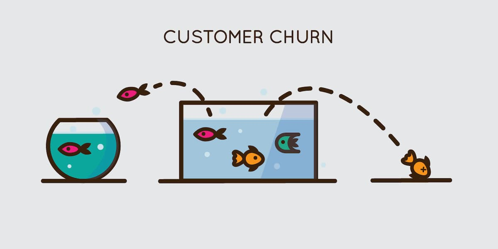

# Analise_de_dados_churn

## 1.Objetivo

  - Analisar a afirmação de que 26% dos clientes estão entrando em churn
  - Tirar insights de grupos ou fatores que tem maior tendência de efetuar cancelamento
  - Propor ações para as conclusões obtidas

## 2.Estratégia

  - Importar as bibliotecas essenciais para esse problema
  - Importar a base de dados
  - Visualizar os dados
  - Verificar se os tipos de dados correspondem as entradas no conjunto de dados
  - Verificar os valores faltantes e escolher uma forma de tratá-los
  - Construir gráficos que nos forneça insights sobre os cancelamentos

## 3.Conclusão

  - O gênero do cliente não influencia no cancelamento do produto.
  - Com base na análise dos gráficos de dependentes e casados, podemos observar que famílias maiores tendem a cancelar menos.
  - A coluna MesesComoCliente mostra que quanto maior o tempo de desão do cliente menor a probabilidade dele cancelar
  - Clientes que aderem ao serviço de Fibra tem um cancelamento muito alto
  - Clientes que não possuem serviço de suporte técnico tendem a cancelar mais.
  - Tipos de contrato mais longos tendem a ter baixo churn
  - Clientes que optam por pagar através de boleto eletrônico tendem a cancelarmais.

## 4.Sugestões de ações a serem tomadas

